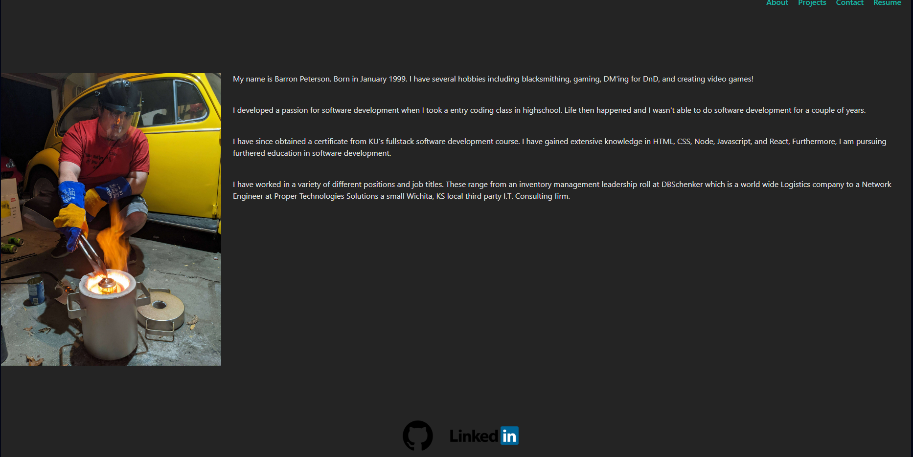

# Portfolio

  
  ## Table of contents

  [Description](#Description)

  [Installation](#Installation)

  [Usage](#Usage)

  [Contribution](#Contribution)
  
  [Tests](#Tests)

  [License](#License)

  [Questions](#Questions)

  ## Description 

  This is a React and javascript portfolio for portential employerers.

  ## Installation 

  N/A Website

  ## Usage 

  Feel free to look around!

  ## Contribution 

  No Contributions 

  ## Tests  

  N/A

  ## License 

  N/A

  ## Questions 

  I am on github at [UtuRaiden](https://github.com/UtuRaiden)

  Or my email is barronpeterson56@gmail.com

  ## [Live Webpage](https://uturaiden.github.io/portfolioV2/)
 
  ## Screenshots

  

  
